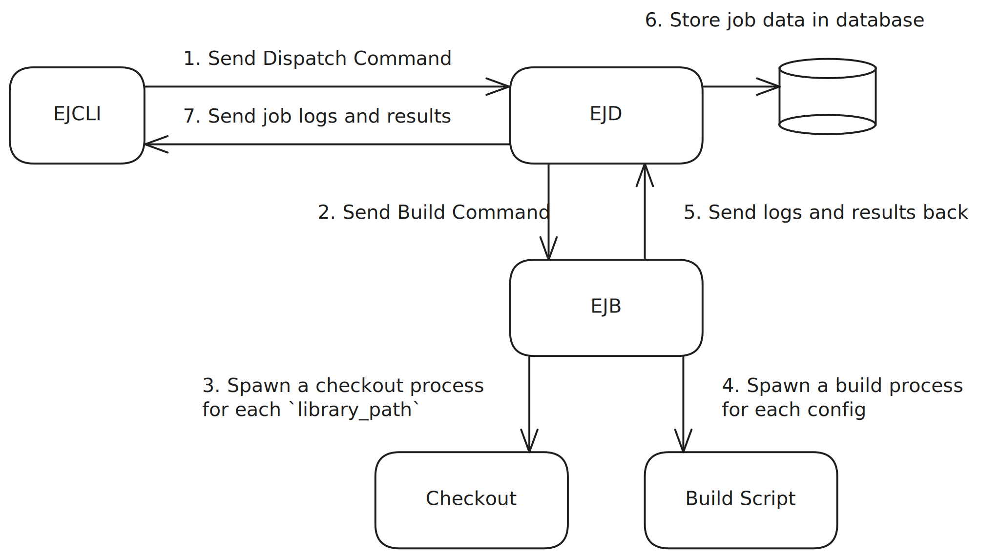

# Guide 03: Setting Up an EJ Dispatcher

## Overview

In the previous guides, we learned how to set up a single EJ Builder and run embedded tests on target hardware. While this works perfectly for individual development and experimentation, real-world embedded development often involves teams, multiple hardware configurations, and integration with CI/CD pipelines.

This guide introduces the EJ Dispatcher (EJD) - a centralized service that transforms your individual EJ Builder into a scalable, multi-user testing infrastructure. You'll learn how to set up a dispatcher, connect multiple builders, and coordinate testing across your development team.

## Prerequisites

Before starting this guide, ensure you have:

- **Completed Guide 02**: This guide builds directly on the EJ Builder setup from the previous guide
- **Docker and Docker Compose**: Required for running the EJD service
- **Basic Linux permissions knowledge**: We'll be working with Unix sockets and user groups
- **Network access**: If deploying across multiple machines
- **Your working EJ Builder setup**: From the previous guide, including the `kmer` project configuration and `ej-workspace`

## What is the EJ Dispatcher?

The EJ Dispatcher acts as the central coordinator for your embedded testing infrastructure. Think of it as a "job scheduler" that sits between your development workflow and your physical hardware.

**Without EJD**: Each developer runs their own EJ Builder instance, manually coordinating access to hardware and managing their own test results.

**With EJD**: A single dispatcher manages a pool of builders and hardware, automatically queuing jobs, distributing work, and storing results in a centralized location.

Key capabilities include:

- **Centralized Job Management**: Queue and automatically distribute test jobs across available builders
- **Multi-Builder Coordination**: Manage fleets of builders with different hardware configurations
- **Team Collaboration**: Multiple developers can submit jobs without hardware conflicts
- **Result Storage & History**: Centralized database stores all test results with full historical tracking
- **Secure Access**: Authentication system controls who can submit jobs and access results
- **CI/CD Integration**: REST API enables integration with automated build pipelines

## When You Need a Dispatcher

The EJ Dispatcher becomes essential when you encounter these scenarios:

**Team Development**: Multiple developers need to share the same embedded hardware without conflicts. The dispatcher automatically queues jobs and ensures fair access to resources.

**CI/CD Integration**: Your build pipeline needs to automatically run embedded tests on every commit. The dispatcher provides the API endpoints and job management needed for automation.

**Hardware Scaling**: You have multiple development boards, different hardware configurations, or geographically distributed test setups. The dispatcher can coordinate across all of them.

**Result Management**: You need to track performance trends, compare results across builds, or maintain historical test data. The dispatcher provides centralized storage and querying capabilities.

**Production Testing**: You're running embedded tests as part of your release process and need reliability, monitoring, and audit trails that a centralized system provides.

## Architecture Overview

```
┌─────────────────┐    ┌─────────────────┐    ┌─────────────────┐
│   Git Repo      │    │   CI/CD         │    │   Developer     │
│                 │    │                 │    │                 │
└─────────┬───────┘    └─────────┬───────┘    └─────────┬───────┘
          │                      │                      │
          │          ┌───────────┼───────────┐          │
          │          │           │           │          │
          └──────────┼───────────┼───────────┼──────────┘
                     │           │           │
                ┌────▼───────────▼───────────▼────┐
                │      EJD (Dispatcher)           │
                │                                 │
                │  ┌─────────────────────────────┐│
                │  │     Job Queue Manager       ││
                │  │  - Queuing & Prioritization ││
                │  │  - Load Balancing           ││
                │  └─────────────────────────────┘│
                │  ┌─────────────────────────────┐│
                │  │     Result Storage          ││
                │  │  - Database Management      ││
                │  │  - Historical Data          ││
                │  └─────────────────────────────┘│
                │  ┌─────────────────────────────┐│
                │  │     Authentication          ││
                │  │  - Builder Registration     ││
                │  │  - Client Access Control    ││
                │  └─────────────────────────────┘│
                └────┬───────────┬───────────┬────┘
                     │           │           │
         ┌───────────┼───────────┼───────────┼───────────┐
         │           │           │           │           │
    ┌────▼────┐ ┌────▼────┐ ┌────▼────┐ ┌────▼────┐ ┌────▼────┐
    │ EJB #1  │ │ EJB #2  │ │ EJB #3  │ │ EJB #4  │ │ EJB #N  │
    │ (Local) │ │ (RPi)   │ │ (Cloud) │ │ (Lab)   │ │ (...)   │
    └─────────┘ └─────────┘ └─────────┘ └─────────┘ └─────────┘
```

## Step 1: Installing EJD

The easiest way to deploy EJD is using the official `Docker` setup.
We have setup [a ready-to-use git repository](https://github.com/embj-org/ejd-deployment)
that uses `Docker` and `Docker Compose` to setup EJD.

```bash
git clone https://github.com/embj-org/ejd-deployment ~/ejd-deployment
cd ~/ejd-deployment
# Follow the prompts to setup your env variables
./setup.sh
# Download and launch EJD along with a postgresql database
docker compose up -d
```

#### TLS Support

If you're looking into deploying EJD into a public network, we very highly recommend setting it up with TLS support.
A skeleton example is available in the same repository inside `tls-example`.
It uses `Traefik` to setup a reverse proxy which will provide TLS support for you.

**NOTE**: It's not a ready-to-use example. Many things depend on your specific setup like DNS provider and URL.

## Step 2: Setup permissions to access the EJD socket

During setup, a Unix Socket was created that can be used to communicate with. By default, you need `root` permissions to access this socket.
This is a security measure as you don't need any sort of authentication when communicating through the socket. Instead the authentication is managed by Linux.
In most setups it'll be used to create the first application user and test your setup and for this we must be explicit about giving ourselves the permissions.

Here we will create a new `group` called `ejd` and change the `group` ownership of the socket file to this new `ejd`.
Once we have done that, we'll add the current user to this new `group` which will allow using this `socket` without having to prefix every command with `sudo`.

```bash
# Create the `ejd` group
sudo groupadd ejd

# Add yourself to the `ejd` group
sudo usermod -a -G ejd $USER

# Change the group ownership of the socket file to 'ejd'
# This allows members of the 'ejd' group to access the file if permissions allow
sudo chown :ejd ~/ejd-deployment/ejd/tmp/ejd.sock

# Grant write permissions to the group for the socket file
# This enables 'ejd' group members to write to the socket
sudo chmod g+w ~/ejd-deployment/ejd/tmp/ejd.sock

# Activate the group changes in the current shell session
newgrp ejd
```

## Step 3: Create your first user

EJ provides `ejcli`, a cli tool that interfaces with EJD.
You can install it the same way we installed `EJB` in the first guide

```bash
cargo install ejcli
```

Now create your first user.

**NOTE**: Replace <username> in the command:

```bash
ejcli create-root-user --socket ~/ejd-deployment/ejd/tmp/ejd.sock --username <username>
Creating user
Password >
CreateRootUserOk(EjClientApi { id: 63c16857-0372-4add-a5bf-c0bd266fe650, name: "<username>" })
```

Enter your password when prompted.

## Step 4: Register your builder

**NOTE**: Replace <username> in the command:

To create the builder, we'll use the rest API interface from EJD.
This can be created from a different PC as long as you have the correct permissions and access to the port EJD is exposed to.

Enter your password when prompted.

```bash
ejcli create-builder --server http://localhost:3000 --username <username>
...
export EJB_ID=<builder_id>
export EJB_TOKEN=<builder_token>
```

The `EJB_ID` and `EJB_TOKEN` provided allows you to connect your EJB instance to EJD.
Again, this connection will use the HTTP(s) interface and as such.

## Step 5: Connecting EJB to EJD

Export the two environment variables gotten from the last command and launch EJB:

```bash
export EJB_ID=<builder_id>
export EJB_TOKEN=<builder_token>
ejb --config ~/ej-workspace/config.toml connect --server http://localhost:3000
```

You should see that the websocket connection was established successfully.

```bash
2025-07-11T11:57:30.191943Z  INFO ejb::connection: WebSocket connection established
```

Once we start a connection, EJB will wait until a new job request comes from EJD.

## Step 6: Dispatch your first build job

Every job that can be dispatched through EJD is associated with a specific git commit hash.
This allows you to later check every job associated with a specific commit.
EJB will automatically check out the new version for you before building.

When dispatching a job you need to provide:

- The commit hash associated with the current job.
- The remote url associated with this commit. (This allows you to run jobs from forks of you repository for instance)
- The timeout time in seconds after which the job will be cancelled.

Optionnally, if you have private repositories and don't want to setup an `ssh` key in the machine hosting your builder,
you may also provide a token that would allow git to fetch your private repository using `https`.

Once again, `ej-cli` can be used to test your setup and making sure everything is working correctly.

Since our test application `kmer` is publicly available we don't need to provide a token:

```bash
ejcli dispatch-build \
 --socket ~/ejd-deployment/ejd/tmp/ejd.sock \
 --seconds 20 \
 --commit-hash eb7c6cbe6249aff4df82455bbadf4898b0167d09 \
 --remote-url https://github.com/embj-org/kmer
```

You should see something like this as a result:

```bash
=======================================
Build finished successfully with 4 log entries:
=======================================
d2a5ae66-5eab-493e-847c-af21a52455d6 - k-mer-original [arm64,kmer unoptimized]
=======================================
From https://github.com/embj-org/kmer
 * [new branch]      main       -> ejupstream/main
HEAD is now at eb7c6cb feat: add infinite loop example
-- Configuring done (0.0s)
-- Generating done (0.0s)
-- Build files have been written to: /home/andre/ej-workspace/kmer/build-pi
[ 25%] Built target infinite-loop
[ 50%] Built target k-mer
[100%] Built target k-mer-original
[100%] Built target k-mer-omp

=======================================
5a5df2de-9854-45b6-a4a5-0af58959a04b - k-mer-omp [arm64,kmer multi-threaded optimized]
=======================================
From https://github.com/embj-org/kmer
 * [new branch]      main       -> ejupstream/main
HEAD is now at eb7c6cb feat: add infinite loop example
-- Configuring done (0.0s)
-- Generating done (0.0s)
-- Build files have been written to: /home/andre/ej-workspace/kmer/build-pi
[ 75%] Built target k-mer
[ 75%] Built target k-mer-original
[ 75%] Built target k-mer-omp
[100%] Built target infinite-loop

=======================================
ffdc80b8-6e59-42e7-af82-3eef5d5ba6bd - k-mer [arm64,kmer optimized]
=======================================
From https://github.com/embj-org/kmer
 * [new branch]      main       -> ejupstream/main
HEAD is now at eb7c6cb feat: add infinite loop example
-- Configuring done (0.0s)
-- Generating done (0.0s)
-- Build files have been written to: /home/andre/ej-workspace/kmer/build-pi
[100%] Built target k-mer-omp
[100%] Built target k-mer-original
[100%] Built target k-mer
[ 62%] Built target infinite-loop

=======================================
aff0ed67-92aa-4011-876b-bf79c51a7210 - infinite-loop [arm64,infinite-loop]
=======================================
From https://github.com/embj-org/kmer
 * [new branch]      main       -> ejupstream/main
HEAD is now at eb7c6cb feat: add infinite loop example
-- Configuring done (0.0s)
-- Generating done (0.0s)
-- Build files have been written to: /home/andre/ej-workspace/kmer/build-pi
[ 50%] Built target k-mer-omp
[ 50%] Built target k-mer-original
[ 75%] Built target infinite-loop
[100%] Built target k-mer

=======================================
```

### Understanding the internals

Congratulations, you have now seen how we can dispatch a new job to EJD that gets picked up by EJB and is run on our target board.



In our specific use case, we have one builder instance with one board connected to it but by now you should have a good understanding of how this whole setup expands to multiple builders and boards.

### Job Cancellation and Timeouts

You can also use the `dispatch-run` command to build and run your application like we've done before.

The process is very similar to the `dispatch-build` command but it will also run the application on the board and wait for it to finish.

```bash
ejcli dispatch-run \
 --socket ~/ejd-deployment/ejd/tmp/ejd.sock \
 --seconds 20 \
 --commit-hash eb7c6cbe6249aff4df82455bbadf4898b0167d09 \
 --remote-url https://github.com/embj-org/kmer
```

In this case, since we still have our `infinite-loop` application being deployed, the job will eventually time out after 20 seconds.

Analyzing the results you'll be able to see 4 log entries for the 4 configs but only 3 result entries as the last config never actually produced any results before the job got cancelled.

This timeout feature relies on the EJ Builder SDK presented in the last guide.
The same way EJD sent the `Build` command in the above example, after the timeout is reached, EJD will send a `Cancel` command to the builder.
The builder will then notify the script performing the build that the job was cancelled. The Builder SDK will receive this cancellation command
and run the cleanup code that provided in our `ejkmer-builder` application.

In cases you don't use the Builder SDK, the builder will eventually kill the process without giving it a chance to clean up, this is why we highly recommend using the Builder SDK for all your builds.

## Next Steps

Congratulations ! You have successfully set up an EJ Dispatcher and connected your first builder. This is a significant step towards building a scalable and manageable testing infrastructure.

You may have noticed that we haven't yet covered how to actually parse the results of the job, how to fetch results from previous jobs. EJ provides two solutions for this:

- The first solution is to directly do it inside your `ejkmer-builder` application. This is a good approach if you don't need any history of the previous results and only care about what the current job produced.
- The second solution is to use the EJ Dispatcher SDK to create a custom CLI tool that can interact with EJD programmatically.
  The same way the `ejcli` tool allows you to interact with EJD, you can create your own custom CLI tool that can submit jobs, query their status, and retrieve results. Additionally, you're free to implement any custom logic you need to parse and analyze the results.

In [Guide 04 - Dispatcher SDK](04-DispatcherSDK.md), we'll create a custom CLI tool that can:

- Submit jobs programmatically
- Query job status and results
- Parse and analyze test data

This SDK-based approach enables powerful automation and integration possibilities.

---

**Production Tip**: When deploying EJD to an open network, always use HTTPS with a reverse proxy like Traefik or Nginx to secure your dispatcher. This prevents unauthorized access and ensures encrypted communication between builders and the dispatcher. A squeleton example using Traefik is available in the [ejd-deployment repository](https://github.com/embj-org/ejd-deployment/tree/main/tls-example)
